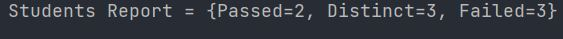
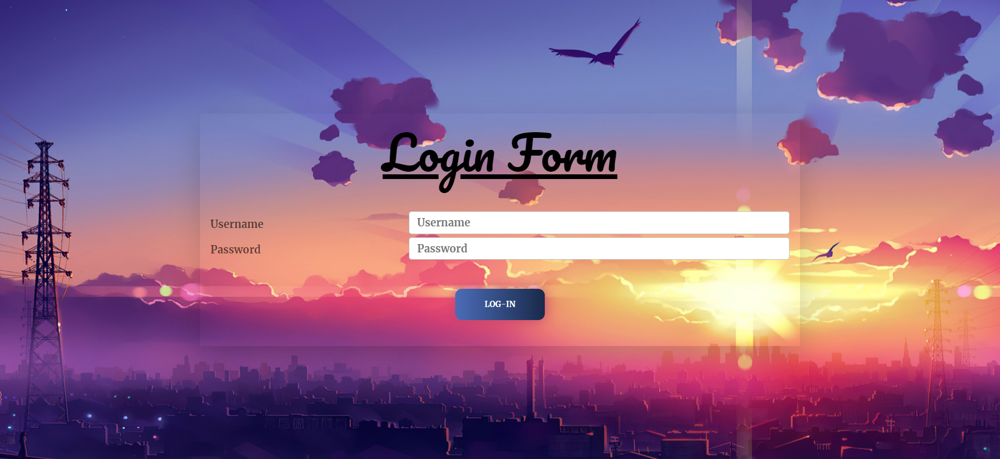
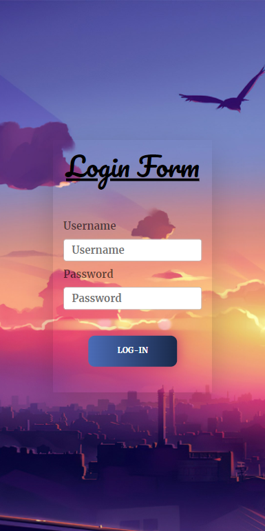
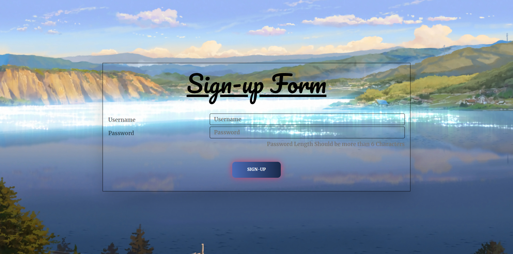
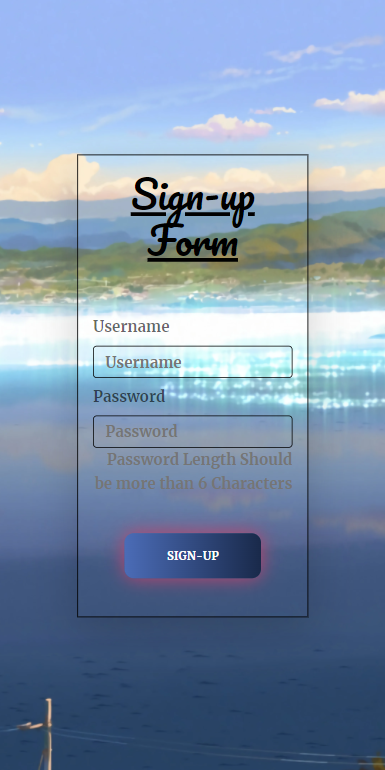

# Growth Guide Take Home Project 

## Assignment 1 - 
[To access the code Check out TakeHomeGG.java]

#### Result Screen Shot : 



## Assignment 2 - 

### Tech Stack Used : 
- Backend  : NodeJs/ExpressJs , Mongoose 
- Frontend : Reactjs , Bootstrap5
- Database : MongoDB

### Working : 


### End Points :
- For User Sign-up  : "localhost:8000/api/v1/user/signup"
    - Body : 
    ```
    "username" : "username",
    "password" : "password"
    ```
    
- For User Log-in   : "localhost:8000/api/v1/user/login"  
    - Body : 
    ```
    "username" : "username",
    "password" : "password"
    ```

### Screenshots : 

#### Login (Desktop)


#### Login (Mobile)


#### Sign-up (Desktop)


#### Sign-up (Mobile)

